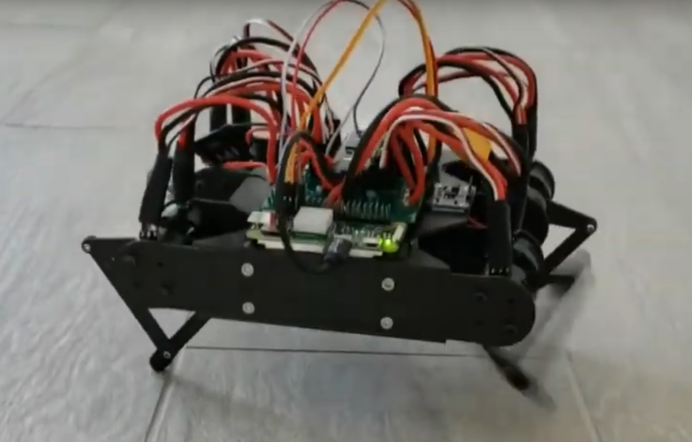

# Lorcan Mini

This repository contains the design files and code for the Lorcan Mini robot.

Lorcan Mini is a tiny quadruped robot with brushless motors. It is intended for machine learning research.
It is also quite cheap, at less than $800 USD.

The motors it uses are [from here](https://www.iq-control.com/vertiq-2306-220kv) - these are small, powerful, and simple to use.

Electronics consist of a custom power delivery board (PDB), a Teensy 4.1, and a Pi Zero.
It also uses [this BEC](https://www.amazon.com/gp/product/B07DYXTX9H/ref=ppx_yo_dt_b_search_asin_title?ie=UTF8&psc=1) to power the electronics from the main battery.

Recommended material to cut the parts out of is Carbon Fiber. I used 2mm CF from [here](http://great3d.com/).
Aside from the cut parts, there are also 4 3D printed bracers.

